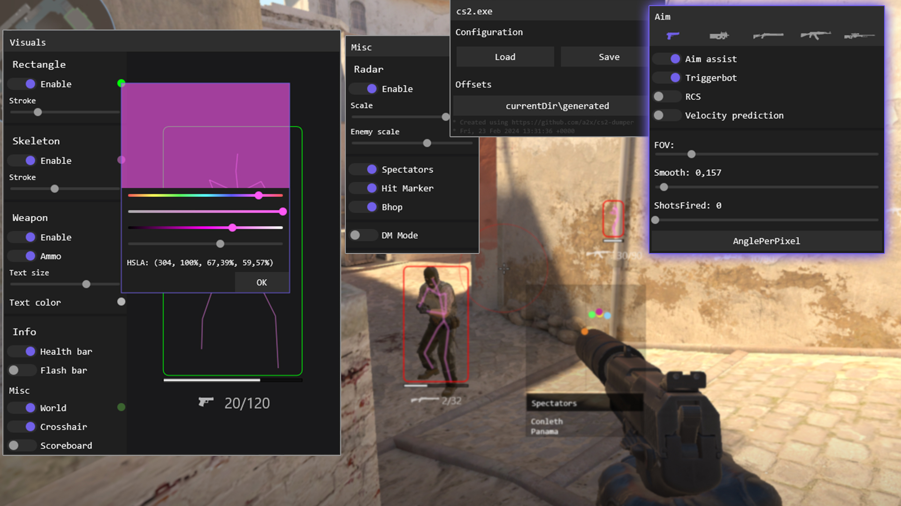
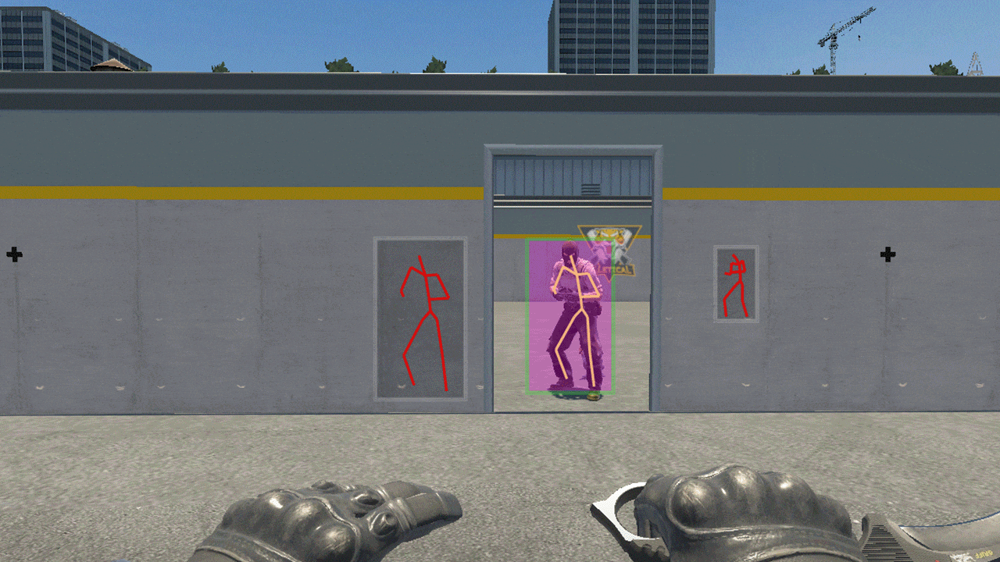


# external чит для cs2



+ Отрисовка
	- Враги
		* Прямоугольник
		* Скелет
		* Оружие
		* Шкалы здоровья и ослепления
	- Гранаты и оружия
	- Прицел для снайперских винтовок
+ [Стрельба](#Стрельба)
	- Помощь в наведении
	- Авто выстрел
	- Настройка под каждый тип оружия
+ Прочее
	- Список наблюдателей
	- Радар
	- Индикатор попадания
	- [Bhop](#Bhop)
	- Загрузка указателей и смещений
		* Из гитхаба
		* Из директории
	- Сохранение конфигурации
+ [Интерфейс](#UI)

<hr>

## Стрельба


## Wallhack ESP




## Интерфейс <a name="UI"></a>


### Создание формы

```cs
class MyForm : UIForm
{
	public MyForm() : base(0, 0, "Название окна")
	{
		Add(new UILabel("Текст"));
            	Add(new UISwitcher("Текст", new((x) => Console.WriteLine($"Значение: ${x}"))));
	}
}
```

## Bhop


Для нормально работы введите эту команду в консоль

```html
alias +jump_ "+jump;+jump";
alias -jump_ "-jump;-jump;-jump";
bind space "+jump_";
bind mouse3 "+jump_”;
```

# Компиляция, запуск и использование

### Требования

+ <a href="https://visualstudio.microsoft.com/ru/">Visual Studio 2022</a>
+ <a href="https://dotnet.microsoft.com/en-us/download">.NET 8 SDK</a>

### Компиляция

> [!NOTE]
> Эти действия повысят безопасность<br>1. Перед компиляцией измените имя проекта<br>2. Компилируйте как нативное AOT приложение<br>3. Запускайте от имени администратора

## Запуск
Установите [шрифт](https://github.com/blyatArtem/cs2/tree/master/cs2/Content/obs_icons.ttf). Далее запустите CS2 и чит.
Если вы меняете чувствительность мыши, то откалибруйте значение "AnglePerPixel" в настройках оверлея.

## Кнопки

<kbd>HOME</kbd> - Переключение оверлея. Кнопку можно изменить <a href="https://github.com/blyatArtem/cs2/blob/10b4a5e381c1ec4ff872da02e76b8fb10cd5c11c/cs2/GameOverlay/Overlay.cs#L245">тут</a>.<br>
<kbd>XButton</kbd> - Наводка и автовыстрел. Кнопку можно изменить <a href="https://github.com/blyatArtem/cs2/blob/10b4a5e381c1ec4ff872da02e76b8fb10cd5c11c/cs2/Game/Features/AimAssist.cs#L367">тут</a>.<br>

:link: **[Список обновлений](cs2/Content/Updates.md)**