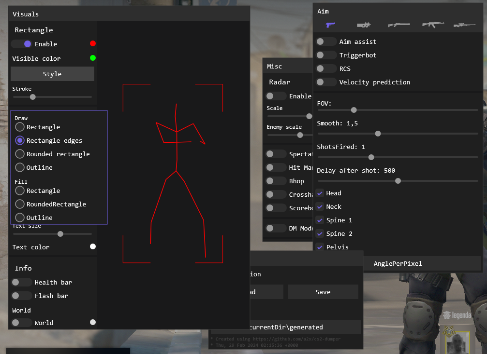

# external чит для cs2



+ Отрисовка
	- Враги
		* Прямоугольник
		* Скелет
		* Оружие
		* Шкалы здоровья и ослепления
	- Гранаты и оружия
	- Прицел для снайперских винтовок
+ [Стрельба](#Стрельба)
	- Помощь в наведении
	- Авто выстрел
	- Настройка под каждый тип оружия
+ Прочее
	- Список наблюдателей
	- Радар
	- Индикатор попадания
	- [Bhop](#Bhop)
	- Загрузка указателей и смещений
		* Из гитхаба
		* Из директории
	- Сохранение конфигурации
+ [Интерфейс](#UI)

## Отрисовка врага <a name="PlayerESP"></a>

текст

## Стрельба


## Интерфейс <a name="UI"></a>


---

# Компиляция и запуск

### Требования

+ <a href="https://visualstudio.microsoft.com/ru/">Visual Studio 2022</a>
+ <a href="https://dotnet.microsoft.com/en-us/download">.NET 8 SDK</a>

### Рекомендации

> [!WARNING]
> Для повышения безопасности:
> Перед компиляцией измените имя проекта
> Компилируйте как нативное AOT приложение
> Запускайте от имени администратора


## Bhop


Для нормально работы введите эту команду в консоль

```
alias +jump_ "+jump;+jump";
alias -jump_ "-jump;-jump;-jump";
bind space "+jump_";
bind mouse3 "+jump_”;
```