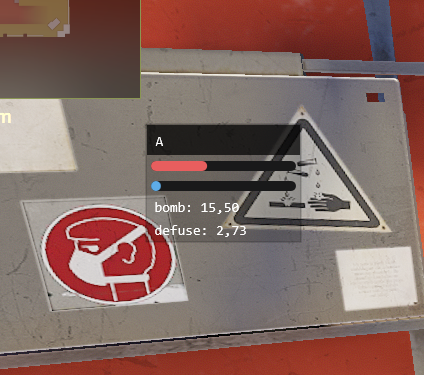
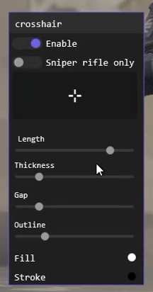
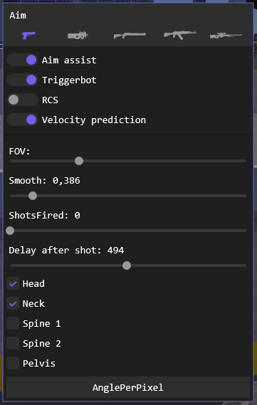


# 1.0.0.6

+ Обновился репозиторий со смещениями
+ Подправил чтобы всё было заебок

# 1.0.0.5

+ (fix) Обновился репозиторий со смещениями

# 1.0.0.4

+ Добавлены настройки производительности
+ Теперь overlay окно определяет размер вашего экрана (Не проверено если 2 или более мониторов)

# 1.0.0.3

+ Добавлена настройка задержки после выполнения функции наведения на цель. Увеличьте значение, если срывает наводка. (мс)
+ Изменен UI Color Picker. Появилась возможность выбрать переливающийся цвет
+ Изменена инициализация позиции форм
+ Добавлена форма Crosshair
+ Добавлена форма Scoreboard
+ Добавлена форма Bomb timer

# 1.0.0.2

#### Основное

+ Добавлена настройка выбора отдельного цвета для видимого врага
+ Теперь можно выбрать тип отображения прямоугольника игрока
+ Перестановка некоторых UI элементов на на законное место

#### Прочее

+ Добавлен UI элемент RadioButton
+ Добавлено свойство видимости игрока

#### Исправления

+ Исправлена наводка

# 1.0.0.1

#### Основное

+ Добавлена настройка задержки после выстрела
+ Теперь калибровка наводки запоминает значение в файле
+ Изменена визуальная часть индикатора попаданий
+ Теперь можно выбирать на какие кости будет наводка

#### Прочее

+ Добавлен UI элемент Checkbox
+ Немного улучшена наводка

